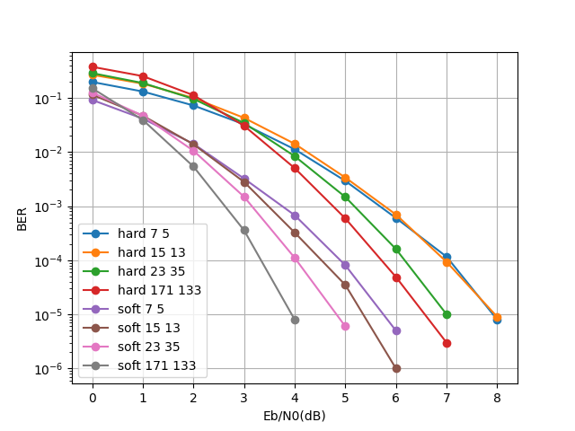

该程序实现了维特比、bcjr、turbo码的编解码

## 编译

### windows

- gcc

```shell
gcc src/*.c -o build/main.exe
```

开启优化：

```shell
gcc -fdiagnostics-color=always -fopenmp -Og -g src/*.c -o build/main.exe 
```

- vscode

安装 C++ 插件，更改 gcc 和 gdb 路径，`Ctrl Shift B`运行默认生成任务

- Visual Studio

直接构建，产物移动到 build 文件夹中

### Linux

```bash
make release
```

## 运行

### 单独运行 main.exe

main函数中`message_length`控制码长，修改后需重新编译

```sh
main SNR_START SNR_FINISH SNR_STEP SEQ_SUM [method] [options]
```

- SNR_START：起始SNR，浮点数
- SNR_FINISH：终止SNR，浮点数
- SNR_STEP：SNR步长，浮点数
- SEQ_SUM：重复次数，整数
- [method]：
  - viterbi_hard/viterbi_soft：维特比软/硬判决译码
    - [options]：卷积码编码器结构，2个整数。如 7 5
  - bcjr：bcjr译码
  - turbo：turbo码编解码
    - [options]：迭代次数，整数

### plot.py

调用`main`并绘制图像，见代码中注释说明

| actions |                   figure                    |
| :-----: | :-----------------------------------------: |
|  base   |        |
|  turbo  |      |
| viterbi |  |

